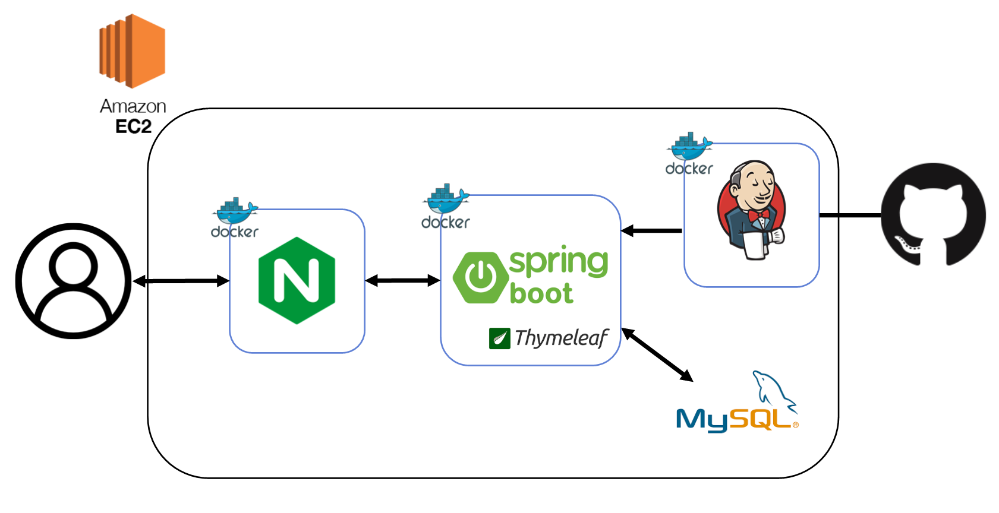
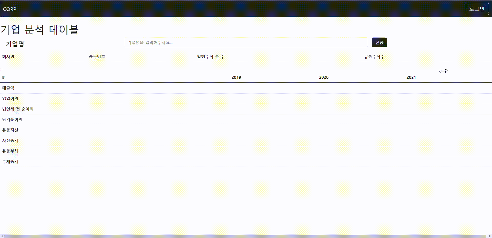

# COMP

> 기업 재무제표 쉽게 확인 할 수 있는 웹사이트

DART에 공시된 기업 재무제표를 쉽게 확인 할 수 있는 서비스.

3년치의 재무제표를 한번에 확인할 수 있다.

카카오로 쉽게 로그인할 수 있다.

서비스 URL : http://3.20.42.141 (배포중단)

## 프로젝트 진행 소개

- 혼자 진행

- 프로젝트 기간: 2022.5.20 ~ 2022.6.27

  

## 주요 기능

| 구분 | 기능               | 설명                                                         |
| ---- | ------------------ | ------------------------------------------------------------ |
| 1    | 기업 재무제표 확인 | Dart Open-api를 사용해서 해당 기업의 3년치의 재무제표를 보여준다. |
| 2    | 회원 가입 & 로그인 | JWT + OAuth2를 사용해서 로그인 기능을 구현했으며, 카카오로 쉽게 로그인할 수 있다. |
| 3    | [무중단 배포](https://github.com/juyongc/PJT_COMP/blob/master/cicd%20%EA%B3%BC%EC%A0%95/CICD.md)        | 서버 컨테이너 두 개를 사용한다.  현재 배포중인 컨테이너가 있다면 다른 컨테이너에 새 배포 파일을 업로드하고 배포하고, 이전 배포중인 컨테이너는 내리는 형식으로 구현했다. |

## 구조도

## 사용 예시

**[로그인 & 기업 재무제표 확인]**

