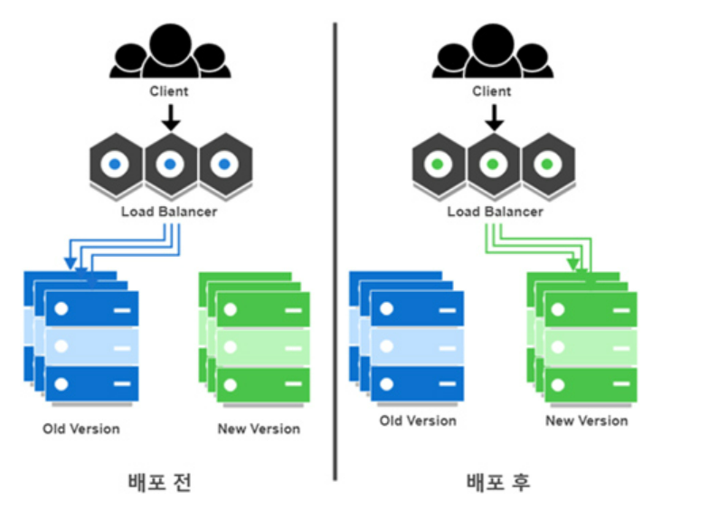
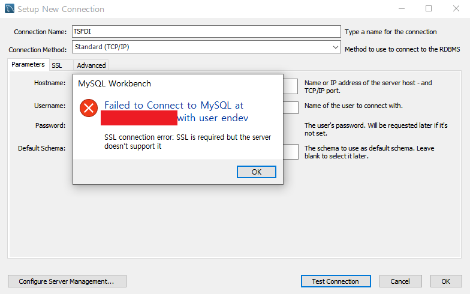
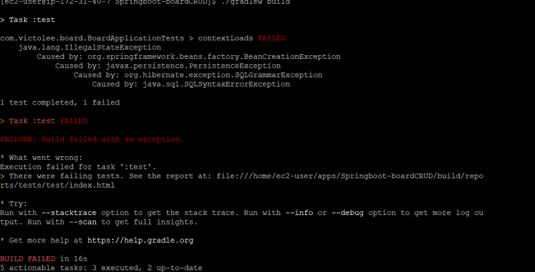
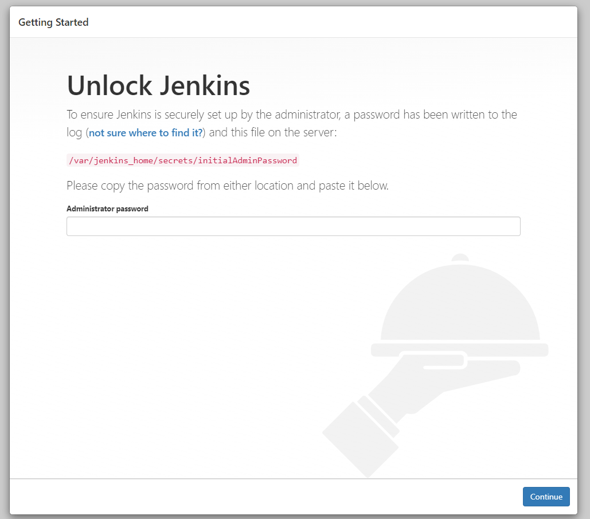
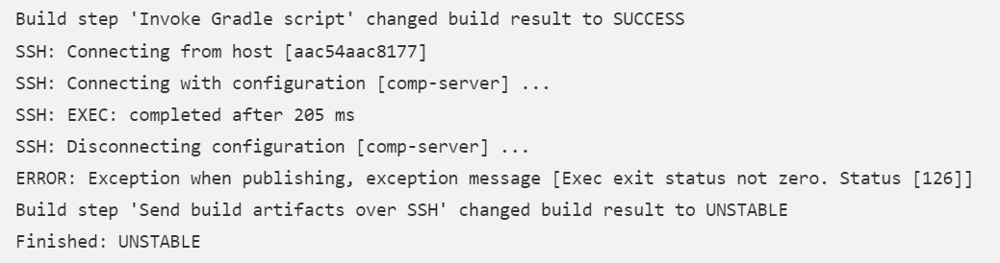
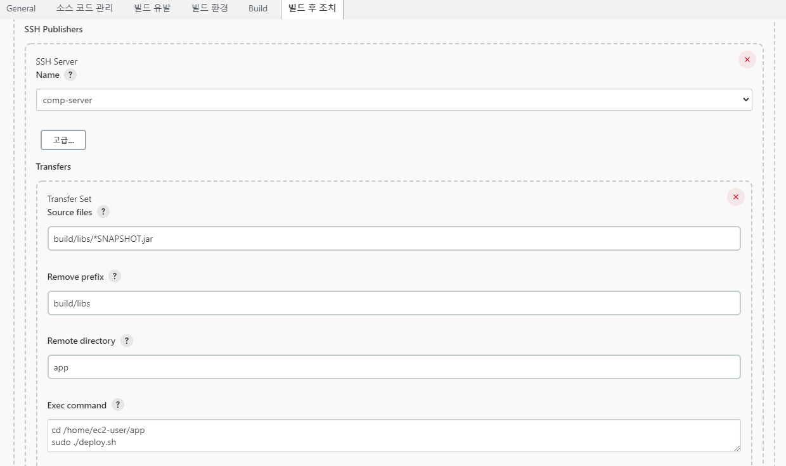
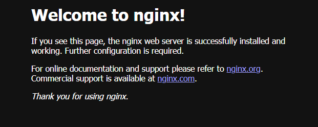

# CI/CD

> 참조
>
> 일반 배포 방법 : https://victorydntmd.tistory.com/338

- [x] AWS EC2 인스턴스 생성

- [x] Putty 연결

- [x] 일반배포 체크 - 배포 파일 확인 위해

- [x] 도커 설치

- [x] jenkins 설치 

- [x] 도커 세팅

- [x] 무중단 배포 방법 생각 및 구현

  

## 배포 방법 정리

> 참조
>
> 무중단 배포 방법 : https://www.samsungsds.com/kr/insights/1256264_4627.html

- 배포 파일 확인

  EC2에서 깃 클론 받은 후, 배포해보고 파일에 문제없는지 확인

- Docker, Jenkins, Nginx, Mysql 등 사용할 툴 설치

  Jenkins, Nginx - docker 공식 이미지 사용

  Mysql - EC2에 직접 다운받아서 사용

- Jenkins - Git webhook 확인

  git에 커밋하면 자동으로 jenkins가 받아오는 지 확인

- 무중단 배포 구현 (블루-그린 배포 방식)

  동작 방식
  
  - 컨테이너 두 개(A,B)를 생성한다.
  - 배포중인 컨테이너(A)가 있다면, 새 배포 파일은 다른 컨테이너(B)에 올린다.
  - 새 배포 파일 컨테이너(B)를 배포하고 올리고, 이전 배포 컨테이너(A)를 내린다. 




## 필요한 ID / PW 정리

- 키 페어 이름 : -
- Putty 로그인 아이디 : -
- mysql 계정 ID / PW : -
- 깃 프라이빗 토큰 : -
- 젠킨스 접속 PW : -
- 젠킨스 계정 ID / PW : -


## EC2

- 초기 세팅

  https://victorydntmd.tistory.com/61

- 주소 : EC2 인스턴스의 퍼블릭 IPv4 주소(3.134.117.105) => Elastic IP 설정으로 변경

  EC2 인스턴스의 퍼블릭 IPv4 주소(3.20.42.141)

- EC2 퍼블릭 주소가 인스턴스 중단 후, 실행하면 변경되는 문제가 있다.

  이를 위해서는 Elastic IP를 설정해줘야한다.

  설정후, 고정된 IP로 사용할 수 있다.

## Putty

- 초기 세팅

  https://victorydntmd.tistory.com/62


## Github

- developer settings - 깃 프라이빗 토큰 생성 

- 젠킨스와 연동할 레포지토리 webhook 걸기

  jenkins와 연동할 repository - Settings - Webhook

  - Payload URL - 젠킨스 서버 주소에 `/github-webhook/` 경로를 추가해서 입력
  - Content type - `application/json` 타입을 사용
  - Add webhook` 버튼


## EC2 서버 내

- 필요한 애플리케이션 설치 - Git, Java,mysql


### 배포 테스트 - git에서 클론해온 뒤, 빌드 후 확인

> 참조
>
> mysql 계정 생성 및 workbrench 연결
>
> - https://harsik.github.io/linux/2019/09/16/MySQL.html
>
>   https://lifelife7777.tistory.com/56
>
> 

- mysql 계정 생성 및 workbrench 연결

- mysql 권한 주기

  ```mysql
  mysql> create user {user id}@'%' identified by {password};
  
  mysql> grant all privileges on {DB name}.* to {user id}@'%' identified by {password} with grant option;
  ```

  

> 만난 오류

- 

  mysql 버전 문제로 SSL을 지원하지 않는 버전이라 SSL 연결 오류라고 나온 것.

  Advanced - others - useSSL=0 을 입력하면 해결됨

- 너무 느린 배포 속도 - EC2 프리 티어는 메모리 1GB라 매우 느리다.

  - 스왑 파일 생성하기

    ```bash
    ## dd 명령 사용하여 루트 파일 시스템에 스왑 파일을 생성
    ## bs는 블록 크기이고 count는 블록 수이다.
    ## 지정한 블록 크기는 인스턴스에서 사용 가능한 메모리보다 작아야 함
    $ sudo dd if=/dev/zero of=/swapfile bs=128M count=16
    
    ## 스왑 파일에 대한 읽기 및 쓰기 권한을 업데이트
    $ sudo chmod 600 /swapfile
     
    ## Linux 스왑 영역을 설정
    $ sudo mkswap /swapfile
    
    ## 스왑 공간에 스왑 파일을 추가하여 스왑 파일을 즉시 사용할 수 있도록 만들기
    $ sudo swapon /swapfile
    
    ## 절차가 성공했는지 확인
    $ sudo swapon -s
    
    ## /etc/fstab 파일을 편집하여 부팅 시 스왑 파일을 활성화
    $ sudo vi /etc/fstab
    
    ## 편집기에서 파일을 연 후 파일 끝에 다음 줄을 새로 추가하고 파일을 저장한 다음 종료
    /swapfile swap swap defaults 0 0
    
    ## free 입력해서 메모리를 확인
    ```


- **에러 : SQLSyntaxErrorException**

  

  테스트 코드 부분에서 에러가 나서 해당 부분 다 지우니 빌드 과정에서 오류는 없어졌다.

  하지만 배포를 하니 같은 오류가 났다. my.cnf 에서

  ``` 
  bind-address=0.0.0.0 
  ```

  을 추가해서 해결했다.

  그러니 **user 'comp'@'%' access denied 에러**가 나왔다.

  확인해보니 **데이터베이스 이름을 compDB로 지어놓고 compdb로 설정해놔서 생긴 문제**였다.

  sql에서 대문자를 소문자로 자동변환하길래 문제없을 줄 알았는데 생각해보니 sql과 관련없는 부분이었다.

  확인 잘하자...

  

### 배포 테스트 결과

- 로그인, 로그아웃, 접근 허가 및 모든 서비스 정상 동작 확인!


### 변경 사항 (도커 사용해서 배포할 때는 다른 방법 사용함)

- 무중단 배포를 하기 위해 포트 2개를 열고 각각 설정 해준 것 확인하기

- properties => yml로 변경 : 직관적으로 보기 위해서

  profiles 설정 및 포트 배정

  ```yaml
  spring:
    profiles:
      include: oauth
  
  --- # set1 환경
  
  spring:
    config:
      activate:
        on-profile: set1
    datasource:
      driver-class-name: com.mysql.cj.jdbc.Driver
      url: jdbc:mysql://3.20.42.141:3306/{DB name}?serverTimezone=UT&characterEncoding=UTF-8
      username: {username}
      password: {password}
    jpa:
      hibernate:
        ddl-auto: update
      generate-ddl: true
      show-sql: true
      properties:
        hibernate:
          format_sql: true
          dialect: org.hibernate.dialect.MySQLDialect
  server:
    port: 8080
    servlet:
      session:
        tracking-modes: cookie
  ---
  
  --- # set2 환경
  spring:
    config:
      activate:
        on-profile: set2
    datasource:
      driver-class-name: com.mysql.cj.jdbc.Driver
      url: jdbc:mysql://3.20.42.141:3306/{DB name}?serverTimezone=UT&characterEncoding=UTF-8
      username: {username}
      password: {password}
    jpa:
      hibernate:
        ddl-auto: update
      generate-ddl: true
      show-sql: true
      properties:
        hibernate:
          format_sql: true
          dialect: org.hibernate.dialect.MySQLDialect
  server:
    port: 8081
    servlet:
      session:
        tracking-modes: cookie
  ---
  ```

- profile 여러개니까 배포 시 주의

  ```
  java -jar comp-0.0.1-SNAPSHOT.jar --spring.profiles.active=set1
  or
  java -jar comp-0.0.1-SNAPSHOT.jar -Dspring.profiles.active=set1
  ```

- 프로젝트에서 build, out 폴더 차이

  out - 인텔리제이 빌드시에 컴파일한 class를 저장하는 폴더

  build - gradle 빌드시에 컴파일한 class를 저장하는 폴더

  application.yml을 apllication.yml로 오타낸 걸 분명히 고쳤는데 적용이 안돼서 보니

  out 폴더에서 변경했었음.

  폴더 확인 잘하자.

  이거 때문에 몇 시간을 날린거야.............. EC2 문제인줄 알고 엄한 애들만 다 날렸네
  
  

## DOCKER

> 참조
>
> 무중단 배포 과정
>
> - https://velog.io/@roo333/%EC%BD%94%ED%94%84%EB%A7%81-CICD-%EB%AC%B4%EC%A4%91%EB%8B%A8-%EB%B0%B0%ED%8F%AC-with-jenkinsdocker
> - http://dev.blog.sellmate.co.kr/post/continuous-deployment/
> - https://ozofweird.tistory.com/entry/Docker-Docker-Compose-%ED%94%84%EB%A1%9C%EC%A0%9D%ED%8A%B8-%EB%AC%B4%EC%A4%91%EB%8B%A8-%EB%B0%B0%ED%8F%AC
> - https://bhsbhs235.github.io/jenkins/springboot/docker/2020/02/02/dockercomposespringboot.html

- 도커 설치

  ```bash
  # 도커 설치
  $ sudo yum install docker -y
  
  # 설치한 Docker 버전 확인
  $ docker -v
  
  # Docker 실행
  $ sudo service docker start
  
  #Docker 그룹에 sudo 추가 (인스턴스 접속 후 도커 바로 제어할 수 있도록)
  $ sudo usermod -aG docker ec2-user
  
  # 인스턴스 재접속 후 Docker 명령어 실행 테스트
  docker run hello-world
  ```

- 도커 명령어

  ```bash
  # 컨테이너 목록 확인
  $ docker ps
  $ docker ps -a
  $ docker ps -a -q
  
  # 컨테이너 생성 및 실행
  $ docker run -i -t {CONTAINER_NAME}
  
  # 컨테이너 접속 및 종료
  $ docker exec -it <컨테이너ID or 컨테이너명> /bin/bash
  $ exit
  
  ## exit - 컨테이너 종료, 나오기
  ## ctrl+p+q - 컨테이너 종료 X, 나오기
  
  # 컨테이너 실행 / 중지 / 삭제 
  $ docker start {CONTAINER_NAME}or{CONTAINER_ID}
  $ docker stop {CONTAINER_NAME}or{CONTAINER_ID}
  $ docker rm {CONTAINER_NAMES} or {CONTAINER_ID}
  
  # 이미지 다운로드 및 컨테이너로 실행
  $ docker pull {IMAGE_NAME}
  $ docker images
  
  # 이미지 삭제
  $ docker images
  $ docker rmi {IMAGE_NAME:IMAGE_TAG}
  ```

- 도커 이미지 다운받기 - jenkins, mysql, nginx

  ```bash
  $ docker pull jenkins/jenkins:lts
  $ docker pull mysql:latest
  $ docker pull nginx:latest
  
  # 이미지 확인
  $ docker images
  
  # 컨테이너 등록 및 실행
  $ docker run -d -p 9090:8080 -v /jenkins:/var/jenkins_home --name jenkins -u root jenkins/jenkins:lts
  ```

  - 도커 컨테이너 명령어 분석

    -d	detached mode = 흔히 말하는 백그라운드 모드

    -p	호스트(앞)와 컨테이너(뒤)의 포트를 연결 (포트포워딩) 로컬 PORT: 컨테이너 PORT

    -v	호스트(앞)와 컨테이너(뒤)의 디렉토리를 연결 (마운트)

    (인스턴스 파일을 도커 컨테이너에 넣어주는 게 아니라

    기본 도커 컨테이너에 생성될 파일을 인스턴스에 내가 만든 파일과 바인딩해주는 것)

    -u	실행할 사용자 지정

    –-name	컨테이너 이름 설정

    

### Docker Compose 설치 및 사용한 도커 컴포즈 파일

> 참조
>
> docker compose 설치 : https://docs.docker.com/compose/install/


- 설치 명령어

```bash
# docker compose 최신버전 다운
$ curl -L "https://github.com/docker/compose/releases/download/$(curl https://github.com/docker/compose/releases | grep -m1 '<a href="/docker/compose/releases/download/' | grep -o 'v[0-9:].[0-9].[0-9]')/docker-compose-$(uname -s)-$(uname -m)" -o /usr/local/bin/docker-compose

# 실행권한 주기
$ sudo chmod +x /usr/local/bin/docker-compose

$ docker-compose --version
```


- 무중단 배포를 위한 도커 컴포즈 파일 (green / blue)

  - docker-compose.green.yml

  ```yaml
  # 위치 : /home/ec-user/app/
  
  version: '3'
  
  services:
    springproject:
      build:
        context: .
        dockerfile: Dockerfile
        args:
          JAR_FILE: comp-0.0.1-SNAPSHOT.jar
      image: springproject:1.0
      ports:
        - "8081:8080"
      container_name: springproject_green
  ```

  - docker-compose.blue.yml

  ```yaml
  version: '3'
  
  services:
    springproject:
      build:
        context: .
        dockerfile: Dockerfile
        args:
          JAR_FILE: comp-0.0.1-SNAPSHOT.jar
      image: springproject:1.0
      ports:
        - "8082:8080"
      container_name: springproject_blue
  ```

  

## JENKINS

> 참조
>
> https://velog.io/@haeny01/AWS-Jenkins%EB%A5%BC-%ED%99%9C%EC%9A%A9%ED%95%9C-Docker-x-SpringBoot-CICD-%EA%B5%AC%EC%B6%95
>
> https://dbjh.tistory.com/71
>
> JAVA 11 버전 사용하기
>
> https://ecsimsw.tistory.com/entry/%EC%A0%A0%ED%82%A8%EC%8A%A4-jdk-%EB%B2%84%EC%A0%84-11%EB%A1%9C-%EC%98%AC%EB%A6%AC%EB%8A%94-%EB%B0%A9%EB%B2%95?category=989733


- 컨테이너 등록한 포트번호 인바운드 확인하기

- 젠킨스 페이지 접속

  

```bash
# docker의 jenkins 컨테이너로 접속하여 패스워드 파일 읽기
# exec - 컨테이너 접속 명령어
docker exec jenkins cat /var/jenkins_home/secrets/initialAdminPassword
```


### Jenkins & Github 연동

- 시스템 설정 - Github server - add github server
- credentials - secret : 깃 프라이빗 토큰 입력
- Test connection 으로 테스트 확인


### Jenkins에서 인스턴스로 어떻게 파일 보내지?

- Jenkins를 도커로 만들어서 git으로 연동받은 스프링부트 파일을 어떻게 배포할 지 고민이었다.

  도커내에 도커를 만드는 건 권장하지 않는다고 해서 방법을 찾아봤는데 jenkins에서 publish over SSH 로 SSH 를 통해 원격 배포할 수 있다.

- jenkins 관리 - 플러그인 관리 - publsih over SSH 설치

- 시스템 설정 - Publish over SSH + SSH Server 입력

> 오류

- 

  deploy.sh에 실행 권한 안줘서 생긴 문제

  ```
  # 실행 권한 주기
  chmod +x /경로/deploy.sh
  ```

  

### Jenkins 배포 설정

>  **freestyle project** 

- 소스 코드 관리 섹션 - Git

  +) Jenkins credential provider 없으면 생성

- 빌드 트리거 - **GitHub hook trigger for GITScm polling**

---

여기까지 한 뒤, git push 해봐서 자동으로 받아오는지 확인

---

- 빌드 - **Invoke Gradle**

  버전은 개발한 gradle 버전과 맞추기(ver.7.4.1)

- 빌드 후 조치 - **Send build artifacts over SSH**

  

  - 보낼 소스 파일

  - .jar 파일은 build/libs/ 에 생성돼서 prefix 없애줬음

  - remote directory : 이동할 디렉토리

  - Exec command

    ```sh
    # 디렉토리로 이동 후, 배포 스크립트 실행
    cd /home/ec2-user/app
    sudo ./deploy.sh
    ```

    

### Jenkins CD 및 쉘 스크립트 실행 구축

- deploy.sh

  ```sh
  # 위치 : /home/ec-user/app/
  #!/bin/bash
  
  echo "start!"
  sudo docker build -t springproject:1.0 .
  echo "docker build"
  
  DOCKER_APP_NAME=springproject
  
  # "blue"라는 이름을 가진 컨테이너가 없으면 - "" / 있으면 springproject_blue~~
  EXIST_BLUE=$(/usr/local/bin/docker-compose -p ${DOCKER_APP_NAME}-blue -f docker-compose.blue.yml ps | grep blue)
  
  # 테스트
  # echo $EXIST_BLUE
  # echo "now"
  
  # EXIST_BLUE 가 빈칸인지 아닌지로 0과 1 구분
  # 없으면 => 블루 빌드 후 올리기 & 그린 내리기
  # 있으면 -> 그린 빌드 후 올리기 & 블루 내리기
  if [ -z "$EXIST_BLUE" ]; then
      echo "blue up"
      /usr/local/bin/docker-compose -p ${DOCKER_APP_NAME}-blue -f docker-compose.blue.yml up -d --build
  
      sleep 10
  
      /usr/local/bin/docker-compose -p ${DOCKER_APP_NAME}-green -f docker-compose.green.yml down
  else
      echo "green up"
      /usr/local/bin/docker-compose -p ${DOCKER_APP_NAME}-green -f docker-compose.green.yml up -d --build
  
      sleep 10
  
      /usr/local/bin/docker-compose -p ${DOCKER_APP_NAME}-blue -f docker-compose.blue.yml down
  fi
  
  ```

  

## Nginx

> 참조
>
> https://willseungh0.tistory.com/137
>
> https://m.blog.naver.com/mincoding/221725561682
>
> https://hyeon9mak.github.io/nginx-upstream-multi-server/
>
> https://bhsbhs235.github.io/jenkins/springboot/docker/2020/02/02/dockercomposespringboot.html


- nignx 도커 컨테이너 실행

  ```bash
  $ docker run -d -p --name nginx 80:80 nginx
  ```

  

- nignx.conf

  ```bash
  # 위치 : /home/ec-user/nginx/
  #nginx 설정
  
  events {}
  
  http {
  
      upstream comp{
          least_conn;
          server 3.20.42.141:8081 weight=5 max_fails=3 fail_timeout=10s;
          server 3.20.42.141:8082 weight=10 max_fails=3 fail_timeout=10s;
      }
  
      server {
  
          listen       80 default_server;
          listen       [::]:80 default_server;
          server_name  _;
          root         /usr/share/nginx/html;
  
          include /etc/nginx/default.d/*.conf;
  
          location / {
                  proxy_pass http://comp/api;
                  proxy_set_header X-Real-IP $remote_addr;
                  proxy_set_header X-Forwarded-For $proxy_add_x_forwarded_for;
                  proxy_set_header Host $http_host;
          }
  
      }
  }
  ```

- dockerfile

  ```bash
  # 위치 : /home/ec-user/nginx/
  
  FROM nginx
  
  COPY nginx.conf /etc/nginx/nginx.conf
  
  EXPOSE 80
  
  CMD ["nginx", "-g", "daemon off;"]
  ```

- docker-compose.yml

  ```yaml
  # 위치 : /home/ec-user/nginx/
  version: '3'
  
  services:
      nginx:
          build:
              context: .
              dockerfile: Dockerfile
          image: nginx:3.0
          ports: 
              - "80:80"
          container_name: nginx_v3
          network_mode: "host"
  ```

  

- nignx 도커 이미지 생성 및 컨테이너 실행 (도커 파일 적용)

  ```bash
  $ docker build -t nginx:3.0
  $ docker run -d --name nginxv3 nginx:3.0
  $ docker-compose up -d
  ```


---

